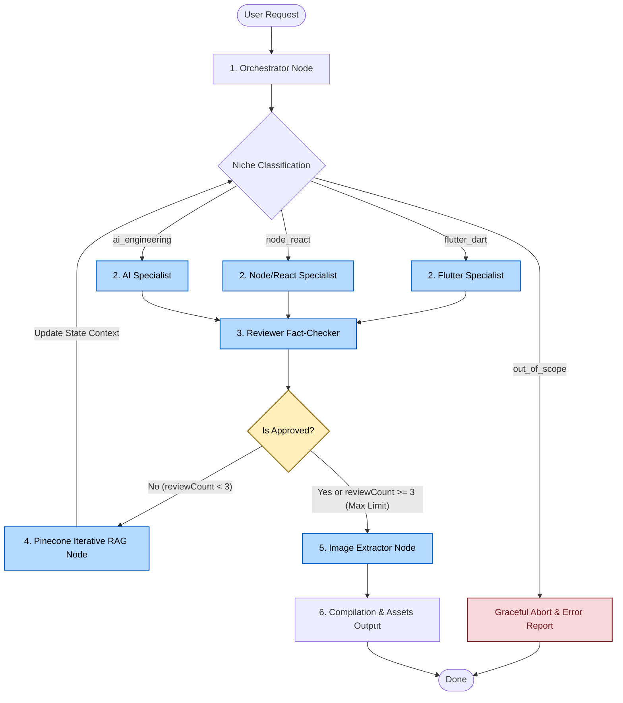

# 🚀 LangGraph Critic-RAG Builder (Autonomous Multi-Agent Content Generator)

[](https://www.typescriptlang.org/)
[](https://github.com/langchain-ai/langgraphjs)
[](https://www.pinecone.io/)
[](https://deepmind.google/technologies/gemini/)
[](https://openrouter.ai/)

An advanced, production-ready **multi-agent content-builder system** powered by **LangGraph** designed to generate high-fidelity, factually accurate technical LinkedIn posts for Software Engineers. It automates the entire pipeline—from niche dispatching and vector database grounding (RAG) to strict code auditing, iterative review loops, and visual asset rendering (code snippets to PNG).

To protect accounts from algorithmic penalties and shadowbans typical of direct API publishing, the system operates on a **Human-in-the-Loop** model. It outputs structured publication packages locally, maximizing the creator's **Social Selling Index (SSI)** through high-value manual publishing.

---

## 🗺️ Architectural Workflow State Machine

The workflow uses a cyclic state machine built on `@langchain/langgraph`. It ensures that a draft is never finalized until it has passed strict factual and syntactic validation.



---

## 🛠️ Deep Dive: The Multi-Agent Pipeline

### 1. The Dispatcher (Orchestrator)
* **Goal**: Analyze the user prompt and classify it into a technical domain (`flutter_dart`, `node_react`, or `ai_engineering`).
* **Interception**: If the request is unrelated (e.g. food recipes, off-topic chats), the Orchestrator classifies it as `out_of_scope`, gracefully aborting the execution and writing a detailed explanation to `output/<slug>/error_report.txt`.
* **Smart Folder Naming**: The Orchestrator generates a succinct folder slug (max 20 characters, e.g., `flutter-shimmer`) based on the topic, optimizing directory structure and preventing operating system filesystem path length issues (`ENAMETOOLONG`).

### 2. Specialized Content Creation (The Engineers)
Each specialist agent is configured with domain-specific developer personas and strict rules:
* **Flutter/Dart Specialist**: Focuses on design patterns, widgets, under-the-hood engine rendering, and clean Dart code.
* **NodeJS/React Specialist**: Tailored for full-stack JavaScript/TypeScript architectures, performance optimization, concurrency, and Event Loop internals.
* **AI Specialist**: Directed toward LLMs, RAG system design, vector stores, and multi-agent frameworks (e.g., LangGraph).

### 3. Strict Critic-Guided Review Loop (The Auditor)
A specialized **Technical Fact-Checker** reviews every generated post. It enforces:
* **Factual Accuracy**: Refuses fabricated framework versions (e.g., claiming a feature was introduced in `Flutter 3.4` instead of `3.10`).
* **Code Soundness**: Rejects code snippets containing placeholders like `child: ...` or ellipses (`// ... perform logic`), demanding self-contained, compilable code.
* **Format Compliance**: Strips inline markdown code blocks and registers them for image rendering instead, outputting clean, readable social media copy.

### 4. Dynamic Iterative RAG (Critic-Guided Retrieval)
Unlike static RAG systems that query the database only once, this workflow implements **Iterative Retrieval-Augmented Generation**:
1. If the Reviewer rejects a post, it outputs a precise search query (e.g., `flutter 3.7 desktop mediaquery resize changelog`) alongside its descriptive critique.
2. The graph routes back to the Specialist, but first triggers a **secondary, targeted query to Pinecone**.
3. The new documentation is merged into the prompt, grounding the Specialist with the correct technical facts to resolve the reviewer's feedback.

### 5. Automated Visual Asset Processing
The system automatically parses all valid code snippets generated by the Specialist and renders them into high-quality syntax-highlighted PNG images using the **Carbonara API** (modeled after Carbon.now.sh). 

---

## 🎛️ Technology Stack

* **LangGraph**: Stateful, multi-agent orchestration via cyclic graphs.
* **TypeScript / Node.js**: Type-safe development environment.
* **Pinecone**: High-performance vector database namespace storage.
* **Google Generative AI Embeddings**: `models/gemini-embedding-001` for converting text to vector space.
* **LLM Engine**: Advanced reasoning models (e.g., `qwen/qwen3-coder-next`) routed via **OpenRouter** to handle Structured JSON Outputs via Zod schemas.

---

## 📂 Output Package Structure

Upon completion, a dedicated directory is created under `/output` with a strict 20-character maximum name size:

```bash
output/flutter-shimmer/
├── linkedin_post.txt    # Optimized LinkedIn post text + hashtags + image annotations
├── snippet_1.dart       # Original compilable Dart source code
├── snippet_1.png        # Rendered code image (Dracula theme, Mac window frame)
├── snippet_2.dart       # Secondary compilable snippet
└── snippet_2.png        # Rendered secondary code image
```

*Note: If the loop reaches its 3-attempt limit without passing the reviewer's audit, the system saves the last draft in `linkedin_post.txt` but prepends a clear `⚠️ AVISO/WARNING` highlighting that the content did not clear all verification parameters.*

---

## 🚀 Setup & Installation

### Prerequisites
* Node.js v20+
* NPM
* A running Pinecone Index populated with documentation vectors.

### Environment Configuration
Create a `.env` file in the root directory:

```env
# OpenRouter Config
OPENROUTER_API_KEY=your_openrouter_api_key_here

# Pinecone Config
PINECONE_API_KEY=your_pinecone_api_key_here
PINECONE_INDEX_NAME=your_index_name_here

# Gemini API Config (Embeddings)
GEMINI_API_KEY=your_gemini_api_key_here
```

### Install Dependencies
```bash
npm install
```

### Run Tests
The repository features automated unit tests covering the orchestrator node classification, out-of-scope interception, and reviewer state routing:
```bash
npm test
```

### Generate a Post
Run the system by passing the topic as a command-line argument:
```bash
npm start "Explain how dependency injection works in Flutter using Widgetbook"
```
